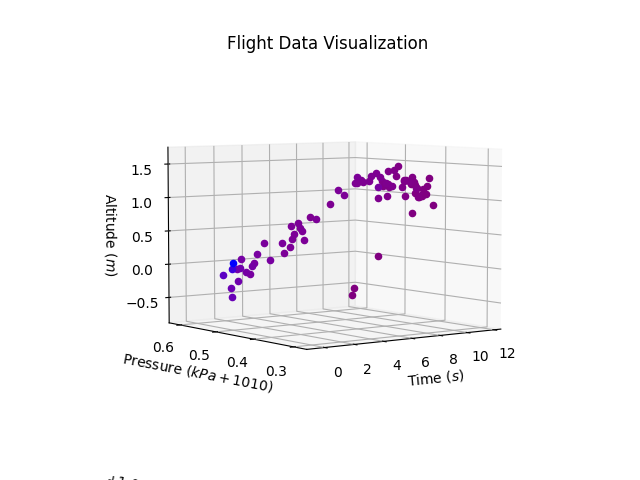
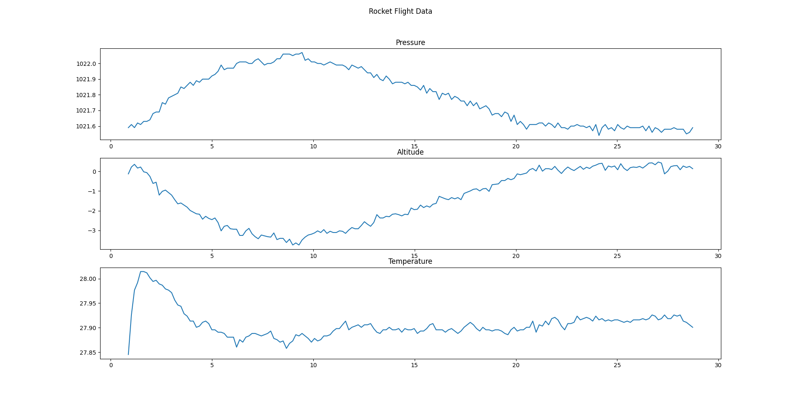
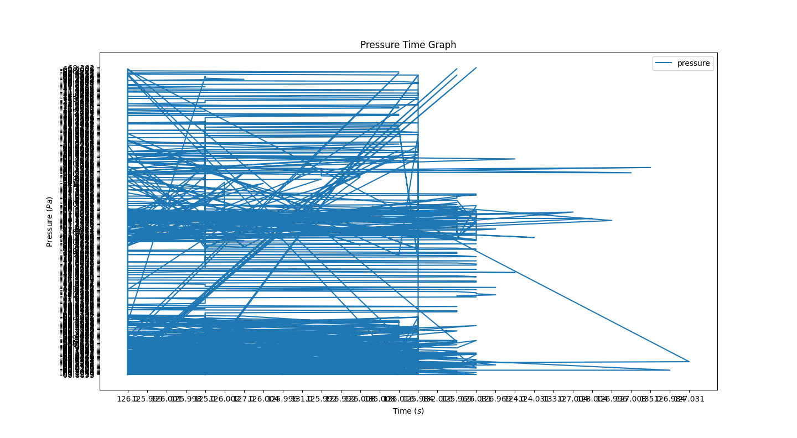

# Small Rocket Project - CHKN-1 Rocket Flight Software

This is the flight software for the Delft Aerospace Rocket Engineering Small Rocket Project, CHKN-1 Rocket. It serves the purposes of autonomous pyrotechnic parachute deployment and telemetry.

## Apogee Detection for Autonomous Pyrotechnic Parachute Deployment
To optimize recovery speed, the parachute should deploy just after apogee is reached. Therefore, the rocket should detect when it is beginning to descend. This is done via a barometer and linear regression model to detect when the pressure is increasing. At its core, the following simplified code describes the mainloop algorithm (skipping over the boring linear regression code).

```python
if rocket.LAUNCHED:
        # (...)
        if launched > apogee - window_before:
            # in deployment window
            # (...)
            if parachute.detectApogee(pressure_log, time_log):
                detonate_blackpowder() # kaboom >:)
```

## Telemetry
Live data is also being continuously saved to a local SD card which is programmed to survived a crash landing due to flushing all data. Below are two examples of small scale tests, in either 3D or 2D format. (Note: The two graphs visualize different test runs)





## Why bother testing rocket code before launching it with live explosives?

To avoid... this ;)


